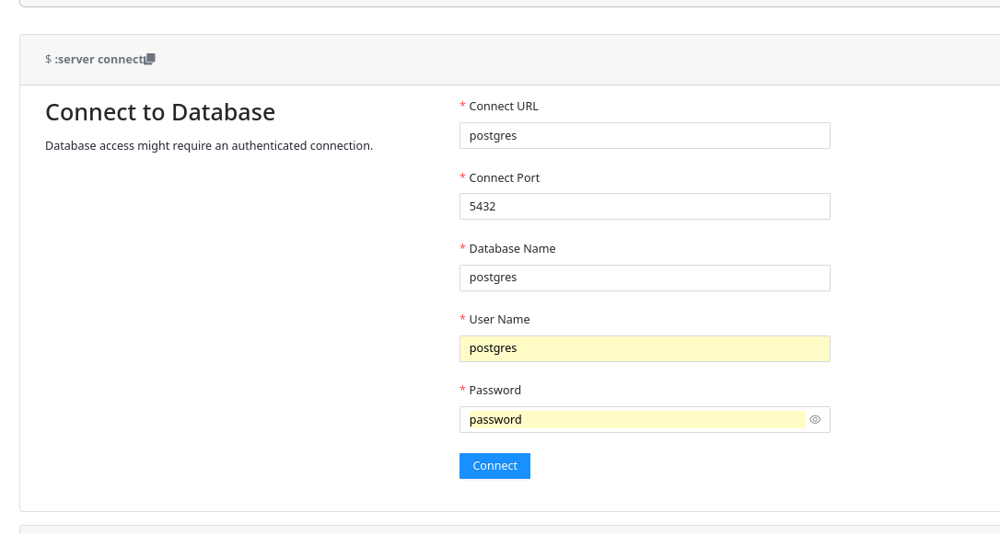
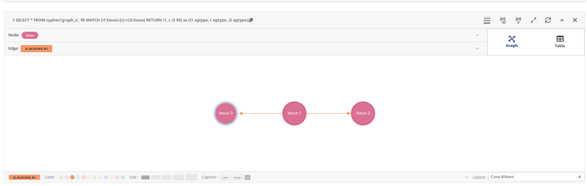

# Import Obsidian vault to Apache Age

In this project, I want to try and import an [Obsidian](https://obsidian.md/) vault into an [Apache Age](https://age.apache.org/) graph-oriented database.

```sh
$ mise install
$ pnpm install
$ docker compose up -d --wait
```

```sh
$ ./scripts/enter-in-pg.sh -f init.sql
$ ./import.js
```

## Age Viewer

```sh
$ firefox http://localhost:3000/
```



Run the following queries either in Age Viewer or in the psql command prompt:

```
$ ./scripts/enter-in-pg.sh
```

```sql
SET search_path = ag_catalog, "$user", public;
SELECT *
FROM cypher('graph', $$
    MATCH (note:Note)
    RETURN note.filename
$$) as (edges agtype);
```



Query all tags:

```sql
SELECT *
FROM ag_catalog.cypher('graph', $$
    MATCH (note:Tag)
    RETURN note.name
$$) as (edges ag_catalog.agtype);
```

Query notes and tags:

```sql
SELECT note_filename, tag_name
FROM ag_catalog.cypher('graph', $$
    MATCH (note:Note)-[:LABELED_BY]->(tag:Tag)
    RETURN note.filename AS note_filename, tag.name AS tag_name
$$) as (note_filename ag_catalog.agtype, tag_name ag_catalog.agtype);
```
